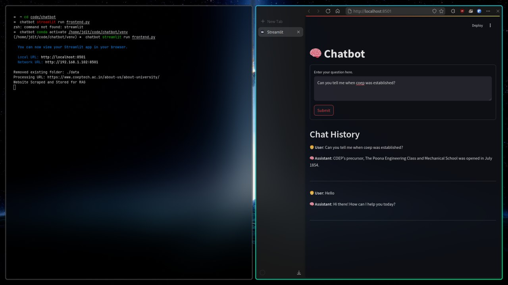

# 🧠 ChatScraper

| Chat UI |
|---------|
|  

---

## 📝 Project Overview

**ChatScraper** is a **Streamlit-based chatbot** that leverages **AI-driven content extraction** and **retrieval-augmented generation (RAG)**. It crawls websites using `crawl4ai` and schema-based LLMs to extract meaningful content, embeds it using `Ollama`, and stores it in **ChromaDB**. Users can then ask questions via a conversational UI and get contextually relevant answers.

---

## ⭐ Features

- LLM-powered content scraping from URLs using `crawl4ai`
- Text extraction via HTML heuristics or schema-based instructions
- Markdown conversion and cleaning for vectorization
- Document chunking and semantic embeddings with `LangChain` + `Ollama`
- Chroma-based vector database for persistence
- Streamlit UI for asking natural language questions

---

## 💻 Installation

```bash
git clone https://github.com/mayureshsaitwal/ChatScrapper.git
cd ChatScraper
```

### (Optional) Create a virtual environment

```bash
python -m venv venv
source venv/bin/activate  # On Windows: venv\Scripts\activate
```

### Install dependencies

```bash
pip install -r requirements.txt
```

---

## 🚀 Running the App

### Step 1: Scrape and Embed Data

```bash
python server.py
```

This script loads HTML and metadata from `./data/html` and `./data/metadata`, processes and embeds them.

### Step 2: Launch the Streamlit Frontend

```bash
streamlit run frontend.py
```

You can now interact with the AI chatbot in your browser.

---

## 📚 Key Components

| Component     | Description |
|---------------|-------------|
| `crawl4ai`    | Intelligent headless web crawler |
| `Ollama`      | Local LLM and embedding model runner |
| `LangChain`   | Conversational retrieval and chaining framework |
| `ChromaDB`    | Local vector database |
| `Streamlit`   | UI for chat interaction |

---

## 📁 Project Structure

```
ChatScraper
├── chat.py                 # Simple LLM call via LiteLLM
├── content.py              # HTML content scraper and saver
├── llm.py                  # Schema-based LLM extraction
├── frontend.py             # Streamlit interface
├── server.py               # Vector embedding and storage
├── prompt.py               # Custom AI response prompt
├── instruction.py          # LLM instructions for extraction
├── urls.txt                # URLs to scrape
├── result.txt              # Scraped site links (from sitemap)
├── requirements.txt        # Python dependencies
└── data/
    ├── html/               # Cleaned HTML files
    ├── metadata/           # JSON metadata for pages
    └── chroma/             # Vector store (generated)
```

---

## ⚙️ How It Works

1. **Scraping**: Uses either standard or schema-based LLM strategies to extract page content.
2. **Cleaning & Chunking**: Processes raw text with `MarkdownTextSplitter`.
3. **Embedding**: Uses Ollama embeddings (`nomic-embed-text`) for vectorization.
4. **Storage**: Saves to ChromaDB for future semantic search.
5. **Querying**: Questions submitted via Streamlit are processed using LangChain's RAG pipeline.
6. **Answering**: The AI responds with a relevant, context-aware message.

---

## 💡 Room for Improvement

- Add ability to input new URLs directly from UI
- Switch between models dynamically (mistral, llama3, etc.)
- Extend to PDF and document scraping
- Add download/export of chat logs

---

## 🚨 Common Errors

- **Model not running**: Start Ollama at `http://localhost:11434`
- **File/path errors**: Ensure your `data/` directory exists
- **Tensor errors**: Use Python ≤ 3.10 if using TensorFlow in future extensions

---

## 👥 Contributors

- **You** – Core Developer & Architect

---

## 📄 License

This project is under the **MIT License**. Free for personal or commercial use.

